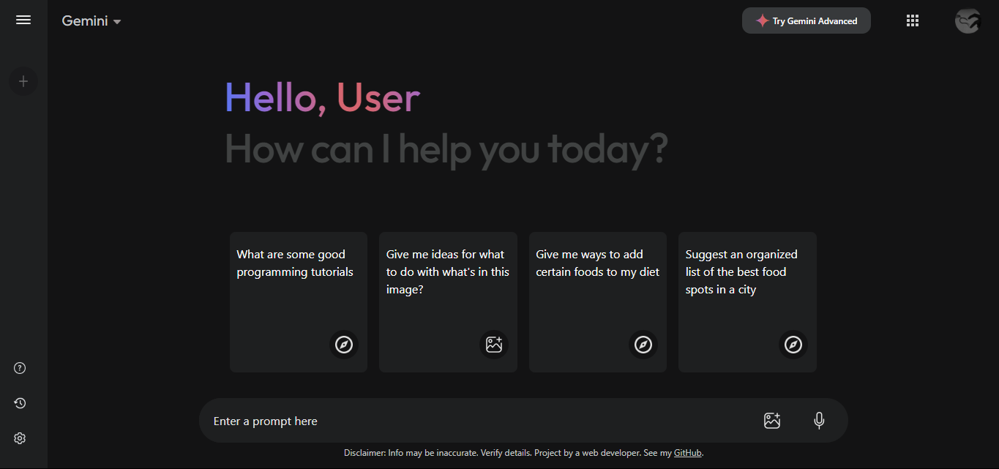

# Gemini Ai Clone using React.js




This project is a clone of Gemini, formerly known as Bard. It consists of a responsive Gemini frontend and an API to make it functional.

Check out the live demo [here]( https://mohdamirwebdeveloper.github.io/Gemini/).

1. Clone the repository:

   ```bash
   https://github.com/mohdamirwebdeveloper/Gemini.git 
   cd Gemini
